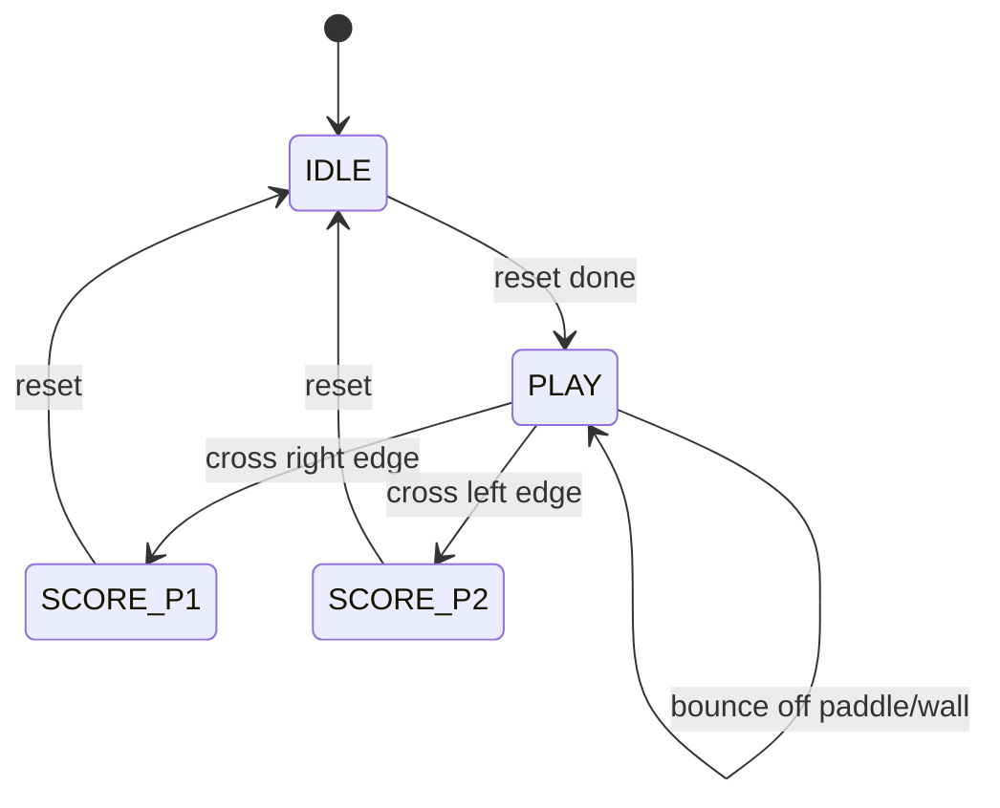
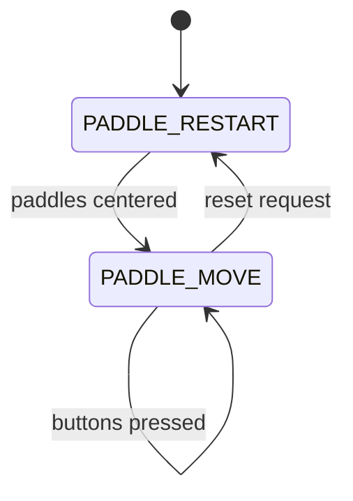
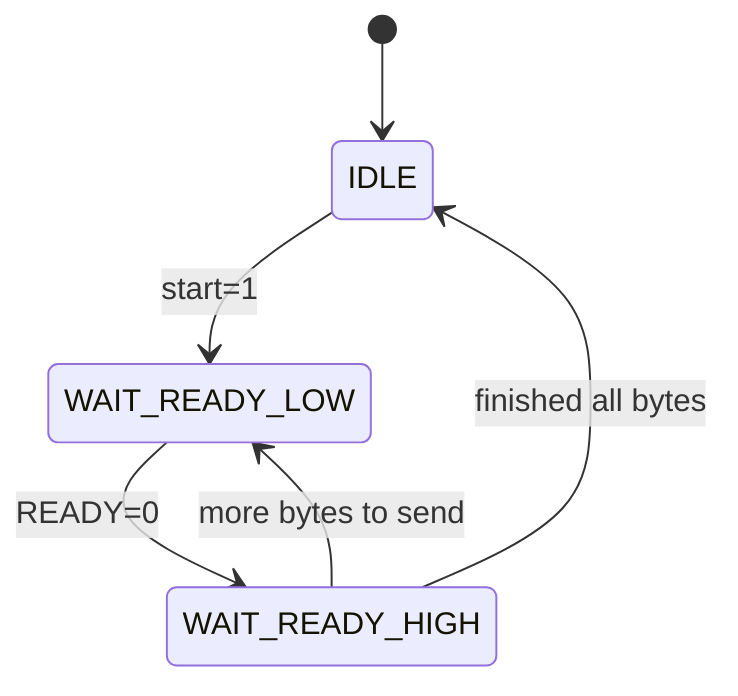
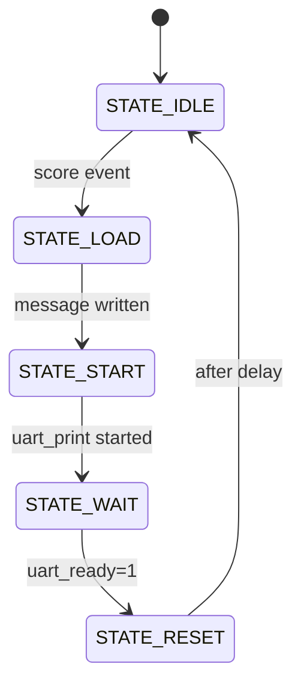
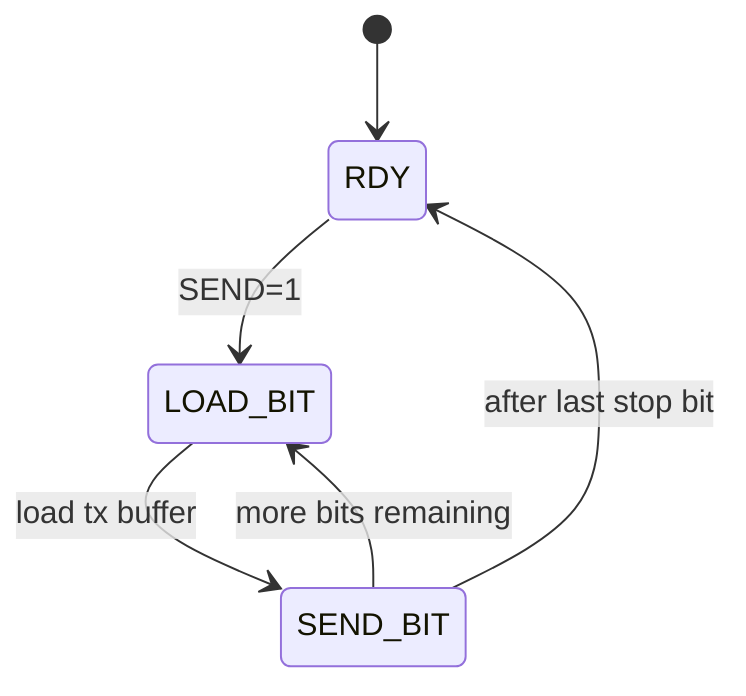

# FPGA Pong

An implementation of the classic Pong game on FPGA with **VGA display** and **UART score output**. The constraints file is written for the Arty-S7 FPGA.

This project drives a 640×480 VGA monitor at 60 Hz, renders the ball and paddles in hardware, and prints scores over a UART serial interface whenever a player scores.

---

## Features

- **VGA Output (640×480 @ 60Hz)**
  - Green paddles
  - Red ball
  - Black background
- **Two-player controls**
  - `btn[0]`: Player 1 Up
  - `btn[1]`: Player 1 Down
  - `btn[2]`: Player 2 Up
  - `btn[3]`: Player 2 Down
- **Scoring system**
  - First to 7 wins, then scores reset.
- **UART Score Printing**
  - On each point, a message like:
    ```
    Player 1+ (3)
    ```
    is sent via UART (9600 baud, 8N1).
- **Simple FSM-based design**
  - Separate FSMs for paddles, ball/scoring, and UART printing.

---

## How It Works

- **Game Loop**
  - Runs on a divided clock tick (approx. 95 Hz with 100 MHz input).
  - Updates paddle positions (from buttons) and ball position.
  - Handles paddle collisions and scoring.
- **Video Rendering**
  - VGA controller generates pixel coordinates and sync pulses.
  - Pong logic draws paddles and ball based on current game state.
- **UART Printing**
  - On score, Pong FSM asserts `p1_scored` or `p2_scored`.
  - UART FSM writes `"Player X+ (N)"` into BRAM.
  - `uart_print` streams the message byte-by-byte via `UART_TX_CTRL`.

### Finite State Machines

This project uses multiple FSMs to manage game logic, paddle control, and UART communication.  

#### Game FSM (Ball & Scoring)



#### Paddle FSM



#### UART Printer FSM



#### Score-to-UART FSM



#### UART TX FSM



---

## Controls

- Connect 4 buttons to the `btn` inputs:
  - **Player 1**: `btn[0]` = up, `btn[1]` = down
  - **Player 2**: `btn[2]` = up, `btn[3]` = down
- VGA monitor connected to `hsync`, `vsync`, `red[3:0]`, `green[3:0]`, `blue[3:0]`.
- Serial monitor connected to `uart_tx` (9600 baud, 8N1).

---

## Simulation

Each module is self-contained and can be tested in simulation:
- **pong_game.v**: simulate paddle movement, ball bounces, scoring.
- **uart_print.v / UART_TX_CTRL.vhd**: simulate UART output.

---

## Synthesis Notes

- Designed for **100 MHz FPGA system clock**.
- VGA requires a 25 MHz pixel clock → generated by ÷4 divider in `vga_controller.v`.
- UART baud rate fixed at 9600 with `BIT_TMR_MAX = 10416` (for 100 MHz).
- Ensure your FPGA board has:
  - 100 MHz system clock
  - GPIOs for buttons
  - VGA connector
  - UART TX pin

---

## TODO / Improvements

- Add RISC-V CPU to control the paddles
  - Add AI opponent mode (auto-moving paddle).
- On-screen score display instead of UART-only.
- Support for different resolutions and baud rates.

---
